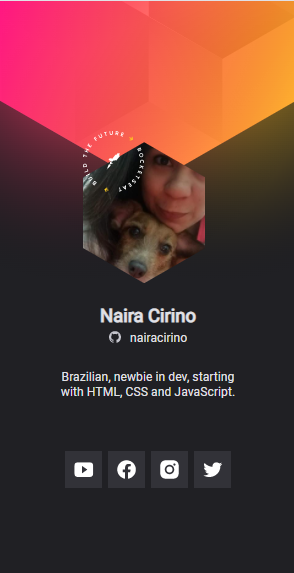

<h1> # Next Level Week Heat - Rocketseat - Origins </h1>
            
Projeto desenvolvido na missão Origin do NLW Heat, evento produzido pela Rocketseat em Outubro de 2021.

Trata-se de um layout de aplicação onde as pessoas podem gerar um crachá virtual para participar do evento Do While 2021. É uma aplicação simples, com objetivo introdutório, não sendo aprofundados os conceitos, e com baixa complexidade que visa ensinar os fundamentos da programação.

O layout original pode ser visualizado no <a target="_blank" href="https://www.figma.com/community/file/1031698737363668691">Figma</a>. O deploy está disponível <a target="_blank" href="https://nairacirino.github.io/NLW-Heat-Rocketseat/">aqui</a>. Foram usados no projeto: HTML5, CSS3, Javascript e JSON e abordados brevemente os seguintes conceitos:
            <ul>
                <li>Fundamentos Web</li>
                <li>Noções de DOM</li>
                <li>HTML: tags e anatomia, aninhamento.</li>
                <li>CSS: seletores e anatomia, cascading, specificity, unidades de medida e reponsivo, box model e layout.</li>
                <li>Javascript: fluxo natural da aplicação, tipos de dados primitivos, variáveis, boas práticas de escrita, dados estruturados.</li>
                <li>Github e Github pages</li>
                <li>APIs</li>
                <li>JSON.</li>
            </ul>

Foi interessante participar dos webinários e construir o projeto pois, como iniciante em programação, ainda não tinha sido apresentada ao JSON em projetos anteriores. Tive também meu primeiro contato direto com o Figma, que pretendo explorar em outros cursos, webnários e projetos futuros.

